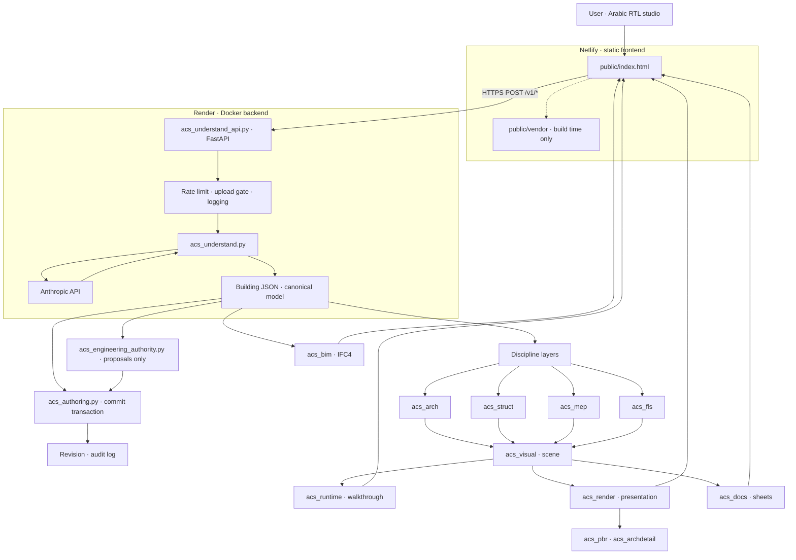

# AI Construction Studio (ACS)

> Every claim in this file was checked against the code in this repository on the
> branch `remediation/production-trust`. Anything that cannot be executed inside
> this sandbox is marked **NOT VERIFIED — EXTERNAL ENVIRONMENT REQUIRED** rather
> than asserted.

---

## 1. Product description

ACS turns a natural-language description of a building into a structured,
inspectable building model, and then into 3D geometry, drawings, schedules and
BIM exchange files.

The user writes a description (for example a villa, a warehouse, an office
floor). A language model converts that description into **Building JSON** — the
canonical model. Every layer downstream reads that model and derives something
from it: architectural elements, structural representation, MEP representation,
fire-and-life-safety topology, a visual scene, a walkable runtime scene,
documentation sheets, and an IFC4 exchange file. No downstream layer writes back
into the model.

The product is **bilingual Arabic/English**, weighted towards Arabic:

- The studio UI (`public/index.html`) is Arabic and right-to-left
  (`<html lang="ar" dir="rtl">`), with English used for product names, technical
  identifiers and some embedded blocks (`lang="en"` appears in the page).
- All source comments and module docstrings are Arabic.
- Model identifiers, JSON keys, API field names, error codes and log fields are
  English and ASCII.
- Descriptions submitted for generation may be Arabic or English.

What ACS explicitly does **not** do — this is enforced by the code and asserted
by the test suites, not merely a statement of intent:

- No structural design, no load calculation, no sizing.
- No MEP design or system calculation.
- No fire engineering and no evacuation simulation.
- **No regulatory or code-compliance determination of any kind.** `acs_rules.py`
  is a rules *engine* with no regulatory content; `acs_occupancy.py` carries
  synthetic classifications only. Nothing in this repository claims that any
  produced model is compliant, approved, safe or permit-ready.

---

## 2. Current maturity / status

| Aspect | State |
| --- | --- |
| Stage | Working system under active remediation, not a released product. |
| Branch | `remediation/production-trust`. |
| Backend | FastAPI service, deployed as a Docker image (Render blueprint present). |
| Frontend | Single static page published by Netlify. |
| Authentication | **None.** The login card in `public/index.html` is local only — it stores a name in `localStorage` and hides itself. Its own hint text says a real authentication backend is not connected yet. Treat every deployment as public. |
| Persistence | None on the server. There is no database; projects live in the browser session. |
| Test material | 10 phase/remediation suite runners, plus deployment and security verifiers (§14). |
| Known open issues | 9 tracked items in `KNOWN-ISSUES.md`, summarised in §19. |

Verified in this sandbox during this work:

- `sh tests/deploy/verify_deploy.sh` → `DEPLOY VERIFICATION: 429 passed, 0 failed`.
- `python3 tests/security/test_security.py` → `BACKEND/CONFIG SECURITY: 365 passed, 0 failed`.
- `python3 tests/remediation/test_build_metadata.py` → `BUILD METADATA: 93 passed, 0 failed`.

Not verified here: anything requiring the network, a browser with a real WebGL
context, an Anthropic API key, or a Redis server. See §19 and §20.

---

## 3. Architecture diagram



Two rules the diagram encodes and the code enforces: the arrow into the canonical
model exists only through `acs_authoring.commit_transaction`, and every arrow out
of it is read-only.

---

## 4. Frontend architecture

`public/index.html` is a **44 KB shell**: markup, one inline import map, a stylesheet
link, five classic boot scripts and one module entry. It contains no executable inline
JavaScript, no `<style>` block and no `style=` attribute — that is what allows the
strict CSP in §16.

```
HTML shell  →  boot scripts (classic, run before modules)
                 boot/api-base.js       the single API origin
                 boot/build-info.js     window.ACS_BUILD_INFO (stamped at deploy)
                 boot/engine-guard.js   window.ACS init, login gate, 12 s engine warning
                 boot/debug-toggle.js   ?debug=1 counter
                 boot/a11y-baseline.js  ARIA sync, focus trap — deliberately not a module
            →  app/main.js  (module entry — imports in evaluation order)
                 shared-state.js   __ACS_SHARED · 8 bindings written across modules
                 late-bindings.js  __ACS_LATE  · 20 forward references
                 core/viewer.js        geometry, materials, Arabic parser, compile()
                 core/standards.js     rules registry, ingest, sources, occupancy
                 core/disciplines.js   architecture, structure, MEP, FLS compilers
                 generated/*.js        10 browser mirrors, written by tools/build_*.py
                 render/scene.js       renderer, scene, camera, render loop
                 ui/workspace-ui-wiring.js
                 trust/core.js         pure: persistence, error table, idempotency
                 trust/wiring.js       DOM, IndexedDB, network
```

**Two rules make the split safe, and both are tested** (`tests/remediation/test_module_graph.js`):

1. The first-party import graph is **acyclic**, and every edge points *backwards* in
   `main.js`'s order — so module evaluation order is exactly the order the code had when
   it was one file. Forward references go through `late-bindings.js`.
2. An ES import binding is read-only, so the few names that are *assigned* from another
   module live on `shared-state.js` instead.

The generated mirrors remain authoritative: `tools/build_*.py` read the `acs_*.json`
specs and splice their block between its markers inside the module file, preserving the
wrapper byte-for-byte. Running every generator twice leaves `public/` byte-identical.

`tools/frontend_split.js` and `tools/frontend_shell.js` performed the one-time migration
and are kept as provenance — they parse the source with a real JS parser and generate
every `import`/`export` from a scope computation, so the split is reproducible and
reviewable rather than hand-cut.

**Not yet done:** the optional feature panels (BIM, Documentation, PBR, Architectural
Detail) are still imported eagerly — see KI-12 in `KNOWN-ISSUES.md`.

## 5. Backend architecture

`acs_understand_api.py` is a FastAPI application. Its transitive import closure —
computed and asserted by `tests/deploy/verify_deploy.py` — is 15 modules.

Routes (all of them; there are no routers and no dynamically added routes):

| Method | Path | Purpose |
| --- | --- | --- |
| GET | `/` | Liveness stub with the endpoint list. |
| GET | `/health` | Process liveness plus configuration sufficiency, subsystem health blocks, and a `build` block from `acs_build_info`. Reports `api_key_configured` as a boolean; never the key. |
| GET | `/version` | Build provenance: `git_sha`, `git_sha_short`, `git_branch`, `built_at`, `provenance_verified`, `schema_versions`. |
| GET | `/ready` | Readiness, distinct from liveness: key present, model within the allowlist, SDK importable. |
| POST | `/v1/understand` | Description → Building JSON. Returns a `generation` telemetry block. |
| POST | `/v1/edit` | Engineer edit of an existing model. |
| POST | `/v1/understand/image` | Image upload → Building JSON. |
| POST | `/v1/understand/pdf` | PDF upload → Building JSON. |

Request path, in order: CORS middleware over an explicit origin allowlist →
structured request logging (`acs_logging`) → rate limiting (`acs_rate_limit`) →
upload validation for the two upload routes (`acs_upload_security`) → generation
executed as a cancellable job (`acs_generation_job.run_job`) → `acs_understand`
→ Anthropic API → validation (`acs_validate`).

Every failure path returns the unified error envelope from `acs_api_errors.py`
(`ERROR_CONTRACT_VERSION = "acs-error-envelope/1.0.0"`), including the
`504 ACS_TIMEOUT` deadline case, so a client always receives classified JSON
rather than a bare connection drop.

Generation budgeting lives in one place: `acs_generation.py` derives every stage
ceiling from a single declared output budget by fixed shares
(`plan` 0.50, `detail` 0.75, `repair` 1.00, floor 4000 tokens) instead of five
independent constants.

---

## 6. Canonical model concept

The canonical model is **Building JSON**. Its shape, as used throughout the code:

```
meta          name, type, provenance, disclosure
site          { w, d }              metres
floor_height  wall_h  wall_t        structural constants, metres
levels        [{ index, name, template }]
floors        { <template>: { rooms: [ { id, rect:[x,z,w,d], role, walls,
                                         doors[], windows[], points[],
                                         furniture[] } ] } }
```

Coordinate convention, documented in `acs_project.py` and unchanged since
phase 1: **X** = width east–west, **Z** = depth north–south with `z = 0` at the
north face, **Y** = height upward. Units are metres. Origin `(0,0,0)` is the site
corner. Level elevation is `level.index * floor_height`.

`acs_project.py` wraps this in a `PROJECT → SITE → BUILDINGS → FLOORS → SPACES`
hierarchy as a pure adapter: the phase-1 model becomes a building node inside the
project without being rewritten, and `to_project()` deep-copies so it cannot
mutate its input.

Two invariants the suites pin:

- **The unknown stays unknown.** A value the source did not state is not filled
  with zero, a default or an estimate; it is declared `NOT_SPECIFIED`. Where a
  layer needs *something* to draw, it carries a separate `render_fallback` that
  never becomes engineering data.
- **Model hash.** `acs_authoring.model_hash` and
  `acs_engineering_authority.model_hash` compute the same SHA-256 over a
  canonical JSON encoding, and the browser mirror uses the same canonical
  encoder. Identifiers are deterministic — no time, no randomness, no UUID enters
  any hash.

---

## 7. Authoring transaction model

`acs_authoring.py` is the **only** write path into the canonical model. Every
edit is a classified `AuthoringCommand` moving through one pipeline:

```
command → normalise → preview on a candidate copy → validate → ready
        → explicit commit → new revision + audit entry
```

Rules the module enforces:

- There is no `setModel`, no `writeModel`, no free-path write, and no escape
  hatch. The runtime scene is ephemeral; the model is never edited in place.
- Every commit produces a new revision and an audit log entry. No silent save.
- Validation means structural coherence of the data — not code compliance, not
  safety, not adequacy.

**Engineering authority** is separated from authoring. The system holds no
engineering authority of its own:

- `acs_engineering_changes.json` is a registry of every change the system may
  make. Each rule declares `change_id`, `source_module`, `class`, `reason`,
  `changes_canonical_model`, `requires_user_confirmation`, `provenance_required`.
- Exactly two classes exist: `SAFE_NORMALIZATION` (bounded, provenance-recorded,
  never overwrites a user-stated value; e.g. `LAYOUT_ROUND_RECT` with a declared
  tolerance of 5 mm) and `ENGINEERING_PROPOSAL` (adding an exit, a sprinkler, a
  smoke detector, a door, a camera; resizing a zone; expanding the site) which
  **always** requires explicit confirmation.
- `acs_engineering_authority.plan()` produces proposals and leaves the model
  byte-identical — the hash before and after planning is the same.
- `acs_engineering_approval.approve()` routes through
  `acs_authoring.commit_transaction` and nothing else. There is no approve-all,
  an unknown proposal id is refused, and a proposal computed against a different
  revision is refused as `STALE_BASE_REVISION`.
- `acs_layout.autofix` defaults to `AUTHORITY_PROPOSE` and writes nothing; an
  unknown authority mode raises rather than being assumed.

---

## 8. BIM

`acs_bim.py` handles exchange with building information models.

- **Export:** the canonical model is written to a real IFC4 file in
  ISO-10303-21 (STEP physical file) form.
- **Import:** STEP files are actually parsed — a full text parser, not a
  heuristic. Cycles are detected on every traversal, every bound is finite and
  declared, and no remote resource is fetched.
- Imported content lands in an external *staging* model. It never writes into the
  canonical model directly; acceptance goes through the phase-5 authoring path
  like any other edit.
- No unit is guessed, no thickness is invented, and an unsupported entity is
  never impersonated as a supported type.
- An external material name is not evidence of fire resistance, a structural
  grade, or compliance.

`acs_compiler.py` is a separate offline tool: Building JSON → glTF 2.0, with a
built-in glTF writer (numpy only) and layered node names
(`LAYER|F<level>|<room>|<detail>`). It is deployed nowhere by design and is run
from the command line.

---

## 9. Documentation

`acs_docs.py` derives construction documentation from the canonical model:
views, dimensions, annotations, schedules, quantities, sheets and vector output.

The governing rule: canonical layers carry a value together with its source and a
separate `render_fallback` for display. Documentation reads the **declared value
only**. A missing value is documented as unknown and is never silently replaced
by the display fallback.

`acs_workspace.py` derives the product workspace view models on the same terms —
project tree, inspector, issue centre, requirement coverage, and the operations
available for a selected element. It never edits the model; every edit goes
through an authoring command.

---

## 10. Visualization

Four layers, each strictly derived and each forbidden from writing back:

| Module | Role |
| --- | --- |
| `acs_visual.py` | Builds the visual scene from the compiled discipline models: objects, materials, lighting, cameras, environment, presentation state. Compiling it leaves every discipline model byte-identical. |
| `acs_runtime.py` | Derives a walkable runtime scene and an ephemeral runtime state: walkable surfaces, obstacles, portals, interaction capabilities, spatial index, selection, isolation, measurement, camera. One-way flow — model → coordination → visual → runtime scene → runtime state. |
| `acs_render.py` | Presentation engine: documented render request, camera, materials, lighting, presentation transforms (dollhouse, clipping, floor explode), 2D drawings (plan, section, elevation), and deterministically quantised control stores. |
| `acs_pbr.py` + `acs_archdetail.py` | Visual-quality layer (PBR material resolution with per-field provenance, lighting/shadow/environment/camera profiles with a declared fallback chain, capture data) and architectural display fidelity (detail classification, façade material subdivision, window and door assemblies, cosmetic furnishing and object library, deterministic material variation). |

The boundary these layers share: **they change how the model looks, not what the
model is.** A visual material is appearance only — not a structural material, not
a fire rating, not a thermal property. Decorative content is `VISUAL_ONLY` and is
excluded from every engineering count. An AI-enhanced image is an appearance
improvement and is never written back as engineering truth.

---

## 11. Project structure

### `acs_*.py` — 38 canonical modules

| Module | Role |
| --- | --- |
| `acs_api_errors.py` | Unified error envelope and contract version for the API. |
| `acs_arch.py` | Architectural compiler: semantic model → generic architectural elements (wall, door, window, opening, slab, void, ceiling, roof, stair, lift shaft, core, envelope). |
| `acs_archdetail.py` | Architectural display fidelity (phase 9.2): detail classification, façade subdivision, cosmetic furnishing and object library, deterministic variation. |
| `acs_authoring.py` | Controlled authoring and editing — the single mutation path (command → preview → validate → explicit commit → revision). |
| `acs_bim.py` | BIM exchange: IFC4 / ISO-10303-21 export and real STEP parsing into a staging model. |
| `acs_build_info.py` | Build provenance: service, version, git SHA, branch, build timestamp, schema versions, `provenance_verified`. |
| `acs_compiler.py` | Offline geometry compiler: Building JSON → glTF 2.0 with layered node names. Deployed nowhere. |
| `acs_coord.py` | Cross-discipline coordination and clash detection — detection and tracking only, no auto-fix. |
| `acs_distance.py` | Real geometric path-distance measurement. |
| `acs_docs.py` | Construction documentation: views, dimensions, annotations, schedules, quantities, sheets, vector output. |
| `acs_egress.py` | Egress and evacuation model — topology only, no simulation. |
| `acs_engineering_approval.py` | Approve or reject an engineering proposal; approval routes only through `commit_transaction`. |
| `acs_engineering_authority.py` | Engineering-change authority: the change registry, the proposal planner, safe normalisations, model hash. |
| `acs_fls.py` | Fire and life-safety data model — representation and topology only. |
| `acs_generation.py` | Single declared output-token budget and generation-strategy contract; derives every stage ceiling. |
| `acs_generation_job.py` | Generation as a genuinely cancellable job (process executor, capacity, admission, terminate grace). |
| `acs_ingest.py` | Import of official sources and verification of rule packs. |
| `acs_layout.py` | Arithmetic resolution of spatial overlaps (no LLM); defaults to proposing, not applying. |
| `acs_logging.py` | Structured production logging with field redaction. |
| `acs_mep.py` | Mechanical/electrical/plumbing data model — representation only, no design. |
| `acs_navigation.py` | Circulation and pathfinding. |
| `acs_occupancy.py` | Occupancy classification and code context for the project (synthetic classifications only). |
| `acs_pbr.py` | Visual-quality layer (phase 9.1): PBR materials, lighting, environment, camera profiles, capture data. |
| `acs_programs.py` | Building-type program registry — the single source of truth for programs. |
| `acs_project.py` | Project layer adapter: `PROJECT → SITE → BUILDINGS → FLOORS → SPACES`; deep-copies its input. |
| `acs_rate_limit.py` | Rate limiting with one contract across all server instances: memory or Redis backend, fail-closed by default. |
| `acs_relations.py` | General relationship graph between elements. |
| `acs_render.py` | Presentation engine: render requests, cameras, materials, lighting, presentation transforms, 2D drawings. |
| `acs_revision.py` | Pins every result to the model revision that produced it (canonicalisation + SHA-256). |
| `acs_rules.py` | Code rules engine — structure only, with no regulatory content. |
| `acs_runtime.py` | Deterministic interactive runtime and walkthrough — read-only interaction. |
| `acs_struct.py` | Structural data model — representation only, no design, no loads. |
| `acs_understand.py` | Understanding layer: natural-language description → Building JSON via the LLM, staged generation, repair rounds. |
| `acs_understand_api.py` | The FastAPI service: routes, CORS, limits, error handling, job execution. |
| `acs_upload_security.py` | Upload gate: image / PDF / JSON / DXF validation as a pure framework-free layer. |
| `acs_validate.py` | Engineering validation and self-repair of the produced model. |
| `acs_visual.py` | Visual scene derivation — geometry-preserving depiction, nothing more. |
| `acs_workspace.py` | Derived view models for the product workspace (tree, inspector, issues, coverage, operations). |

21 companion `acs_*.json` files hold the declarative specs (`acs_arch.json`,
`acs_rules.json`, `acs_engineering_changes.json`, …). They are data, not code, and
several are copied verbatim into the browser mirrors.

### `tools/`

Browser-mirror generators (`build_visual_browser.py`, `build_runtime_browser.py`,
`build_authoring_browser.py`, `build_workspace_ui.py`, `build_render_browser.py`,
`build_bim_browser.py`, `build_docs_browser.py`, `build_pbr_browser.py`,
`build_archdetail_browser.py`) and their extracted blocks (`_*_block.js`);
integrity guards (`check_integration.py`, `check_index_guard.py`,
`check_api_base.py`, `check_harness_encapsulation.py`); the Netlify build script
(`netlify-build.sh`) and its offline sibling (`vendor.sh`);
`dependency_audit.py`; `package_release.sh`; `verify-offline.mjs`;
`verify-provenance-browser.js`; and `write_build_info.py` (§18).

### `tests/`

| Path | Contents |
| --- | --- |
| `tests/phase1` | Gate, P0, provenance, type and XSS checks on the earliest contract. |
| `tests/phase2` | Per-discipline suites: arch, coord, distance, egress, FLS, ingest, MEP, navigation, occupancy, relations, render, revision, rules, struct — plus fixtures and parity. |
| `tests/phase3` | Visual layer, adversarial visual cases, dev API, visual performance. |
| `tests/phase4` | Runtime: collision, immutability, measurement, model regression (golden baseline), navigation, portals, selection, browser parity, benchmarks. |
| `tests/phase5` | Authoring: commands, transaction, revision, immutability, AI boundary, integration, browser parity, benchmarks. |
| `tests/phase6` | Workspace: DOM, responsive, security, workflow, walkthrough, parity, screenshots. |
| `tests/phase7` | Presentation render: targets, security, parity, reference outputs. |
| `tests/phase8` | BIM: round-trip, large fixtures, parity, reference outputs. |
| `tests/phase9` | Documentation layer: docs, browser docs, parity, reference outputs. |
| `tests/phase9_1` | PBR visual quality, reference capture, parity. |
| `tests/phase9_2` | Architectural fidelity: alignment, archdetail, backend contract, black-viewport, generation budget, live render, parity. Its `run_all.sh` is the broadest single runner. |
| `tests/security` | `test_security.py` — backend and configuration security assertions over the API module, `netlify.toml`, `Dockerfile`, `render.yaml` and `public/index.html`. |
| `tests/deploy` | `verify_deploy.sh` / `verify_deploy.py` (deployment content closure), `verify_page_boot.js`, `verify_backend_live.py`, viewport-pixel harness. |
| `tests/remediation` | Production-trust remediation suites (engineering authority, upload security, rate limiting, generation cancellation, dependency lock, **build metadata**) plus `run_all.sh`. |
| `tests/remediation_baseline` | Captured baseline logs and environment record from before the remediation. |
| `tests/lib` | `run.js` — the Node harness used by the JavaScript suites. |

### `public/`

`index.html` (the studio application), `privacy.html` (the public bilingual
privacy statement), `assets/env` and `assets/materials` (placeholder READMEs),
`robots.txt` and `sitemap.xml` (§16), and — only after a build — `vendor/`.

---

## 12. Local setup

```sh
git clone <repo> && cd acs
python3 -m venv .venv && . .venv/bin/activate
pip install -r requirements.txt          # anthropic, fastapi, pypdf,
                                         # python-multipart, uvicorn[standard]
cp .env.example .env                     # then fill values locally only
export ANTHROPIC_API_KEY=...             # never commit this
uvicorn acs_understand_api:app --reload --port 8000
```

Frontend, for local browsing:

```sh
sh tools/vendor.sh                       # fetch three / es-module-shims / pdf.js
                                         # into public/vendor — needs network
python3 -m http.server 8080 --directory public
```

Node is needed only for the JavaScript suites and the browser harnesses:
`npm ci` installs `playwright`. The repository currently commits `node_modules`
(playwright and playwright-core only) so browser runs work without network — see
the note in `.gitignore`.

Without `public/vendor` the page loads, the login card works and the panel
works, but the 3D viewport does not — the page shows its engine banner
("تعذّر تحميل محرّك العرض ثلاثي الأبعاد"). That is the expected behaviour of a
bare checkout, not a defect.

---

## 13. Environment variables

Defaults below are the ones in the code, read from the modules rather than
assumed. A blank default means the variable is unset by default and the code
treats it as absent.

### Secret

| Variable | Default | Meaning |
| --- | --- | --- |
| `ANTHROPIC_API_KEY` | *(none)* | Anthropic API key. Entered in the Render dashboard (`sync: false`). Never in a file, never logged; `/health` reports only whether it is present. |

### Model and access

| Variable | Default | Meaning |
| --- | --- | --- |
| `ACS_LLM_MODEL` | `claude-sonnet-5` | Model id used for generation. |
| `ACS_ALLOWED_MODELS` | `claude-sonnet-5,claude-haiku-4-5` | Comma-separated allowlist of models a caller may request. |
| `ACS_ALLOWED_ORIGINS` | `https://sprightly-selkie-d906c3.netlify.app` | Comma-separated CORS allowlist. Never `*` in production. |
| `ACS_TRUSTED_PROXIES` | `1` | Trusted proxy hops when deriving the client IP (clamped 0–16). |
| `ACS_TRUST_X_REAL_IP` | `false` | Whether `X-Real-IP` is read at all. |

### Rate limiting

| Variable | Default | Meaning |
| --- | --- | --- |
| `ACS_RL_GEN_HOUR` | `8` | Generations per visitor per hour. |
| `ACS_RL_GEN_DAY` | `25` | Generations per visitor per day. |
| `ACS_RL_EDIT_HOUR` | `30` | Edits per visitor per hour. |
| `ACS_RL_GLOBAL_DAY` | `400` | Whole-server daily ceiling — the main spend valve. |
| `ACS_RATE_LIMIT_BACKEND` | *(empty → memory)* | `memory` or `redis`. |
| `ACS_REDIS_URL` | *(empty)* | Redis connection URL; required when the backend is `redis`. Never echoed in any health output. |
| `ACS_RL_FAIL_POLICY` | `closed` | Behaviour when the backend fails: `closed` (reject) or `open`. |
| `ACS_RL_MAX_KEYS` | `20000` | Hard cap on tracked keys (memory backend). |

### Input limits

| Variable | Default | Meaning |
| --- | --- | --- |
| `ACS_MAX_TEXT` | `60000` | Max description characters per request. |
| `ACS_MAX_DESC` | `120000` | Max description characters sent upstream. |
| `ACS_MAX_BUILDING` | `900000` | Max model size accepted by `/v1/edit`. |
| `ACS_MAX_UPLOAD_MB` | `12` | Max upload size in MB. |
| `ACS_UPLOAD_MAX_IMAGE_BYTES` | `5242880` | Max bytes per image. |
| `ACS_UPLOAD_MAX_IMAGE_PIXELS` | `40000000` | Max decoded pixels per image (decompression-bomb guard). |
| `ACS_UPLOAD_MAX_IMAGE_SIDE` | `12000` | Max pixels on either image side. |
| `ACS_UPLOAD_MAX_IMAGES` | `6` | Max images per request. |
| `ACS_UPLOAD_MAX_PDF_BYTES` | `12582912` | Max PDF bytes. |
| `ACS_UPLOAD_MAX_PDF_PAGES` | `200` | Max PDF pages. |
| `ACS_UPLOAD_MAX_PDF_TEXT_CHARS` | `400000` | Max characters extracted from a PDF. |
| `ACS_UPLOAD_MAX_JSON_BYTES` | `900000` | Max uploaded JSON bytes. |
| `ACS_UPLOAD_MAX_JSON_DEPTH` | `40` | Max JSON nesting depth. |
| `ACS_UPLOAD_MAX_JSON_KEYS` | `100000` | Max JSON keys. |
| `ACS_UPLOAD_MAX_DXF_BYTES` | `16777216` | Max DXF bytes. |

### Generation budget and strategy

| Variable | Default | Meaning |
| --- | --- | --- |
| `ACS_LLM_MAX_OUTPUT_TOKENS` | `32000` | The single output-token budget; every stage ceiling derives from it. |
| `ACS_MAX_TOKENS` | *(unset)* | Legacy alias for the above, read once then ignored. |
| `ACS_MAX_TOKENS_PLAN` | *(unset → 0.50 × budget)* | Legacy explicit override for the plan stage. |
| `ACS_MAX_TOKENS_DETAIL` | *(unset → 0.75 × budget)* | Legacy explicit override for the detail stage. |
| `ACS_MAX_TOKENS_REPAIR` | *(unset → 1.00 × budget; `.env.example` suggests `48000`)* | Legacy explicit override for the repair round. |
| `ACS_MAX_ESCALATIONS` | `1` | Strategy changes allowed after a truncation. |
| `ACS_MAX_GROUP_SPLITS` | `2` | Group splits allowed after a truncation. |
| `ACS_DEEP` | `auto` | Two-stage generation mode. |
| `ACS_GROUP_SIZE` | `5` | Rooms per detail group. |
| `ACS_WORKERS` | `4` | Concurrent detail groups. |
| `ACS_MAX_GROUPS` | `14` | Hard cap on detail groups. |
| `ACS_REPAIR_ROUNDS` | `1` | Repair rounds after validation failure. |

### Bounded plan chunking (KI-24 · `acs_plan_chunks`)

The plan stage used to be one call that had to emit the whole building; on a
LARGE workload its output did not fit its ceiling and the request died with
`ACS_UPSTREAM_TRUNCATED`. It is now `outline → plan_chunk[0..n]`, with chunk
size derived from the budget and re-derived from measured output.

| Variable | Default | Meaning |
| --- | --- | --- |
| `ACS_MAX_TOKENS_OUTLINE` | *(unset → derived from `ACS_MAX_BUILDING_ZONES`)* | Ceiling for the outline stage. The outline is the one stage that cannot be split, so its ceiling is sized to the declared capacity rather than to a fraction of the budget. |
| `ACS_MAX_BUILDING_ZONES` | `400` | Declared capacity. Above it the outline still keeps every zone but reports `PLAN_OUTLINE_TOO_LARGE`. |
| `ACS_PLAN_BRIEF_MAX_CHARS` | `160` | Contract cap on the per-zone `brief` in a plan chunk. Unbounded prose here is what made the plan output unbounded. |
| `ACS_PLAN_CHUNK_SAFETY` | `0.60` | Fraction of a chunk's ceiling the estimate is allowed to fill. |
| `ACS_PLAN_VERBOSITY_TOLERANCE` | `3.0` | How far past the contract the model may run before a chunk is sent unprobed. Above it, a small pilot call measures the real per-zone cost first. |
| `ACS_MAX_PLAN_CHUNK_SPLITS` | `3` | Times a chunk that reached its ceiling may be halved and retried. The ceiling itself is never raised. |
| `ACS_MAX_PLAN_CHUNKS` | `24` | Hard cap on plan chunks per request. Zones beyond it are resolved deterministically and reported, never deleted. |

### Timeouts and execution

| Variable | Default | Meaning |
| --- | --- | --- |
| `ACS_REQUEST_TIMEOUT_S` | `840` | Server deadline for one request; deliberately shorter than the frontend's 900 s so the client receives a JSON 504. |
| `ACS_UPSTREAM_TIMEOUT_S` | `600` | Deadline for one model-provider call. |
| `ACS_UPSTREAM_BACKOFF_S` | `2` | Backoff between retries of transient upstream faults only. |
| `ACS_WORKER_THREADS` | `8` | In-process generation worker threads. |
| `ACS_JOB_CAPACITY` | `ACS_WORKER_THREADS` (8) | Concurrent generation jobs. |
| `ACS_JOB_EXECUTOR` | `process` | `process` or `thread`; only `process` makes cancellation real. |
| `ACS_JOB_START_METHOD` | `spawn` | Multiprocessing start method. |
| `ACS_JOB_ADMISSION_WAIT_S` | `0.0` | Seconds a request waits for a free job slot. |
| `ACS_JOB_TERMINATE_GRACE_S` | `3.0` | Grace period before a cancelled job is killed. |
| `PORT` | `8000` | Listen port (Render injects it). |

### Logging and diagnostics

| Variable | Default | Meaning |
| --- | --- | --- |
| `ACS_ENV` | `development` | `production` tightens logging defaults. |
| `ACS_LOG_LEVEL` | `info` | One of `debug`, `info`, `warn`, `error`. |
| `ACS_LOG_STACK_TRACES` | on outside production | Whether full tracebacks are logged. |
| `ACS_RAW_DUMP` | `last_llm_response.txt` | File for the last unparseable model reply (server-side diagnostics only). |

### Build provenance (§18)

| Variable | Default | Meaning |
| --- | --- | --- |
| `ACS_GIT_SHA` | *(unset)* | Commit SHA injected by the deployment; highest precedence. |
| `ACS_BUILT_AT` | *(unset)* | ISO-8601 build timestamp injected by the deployment. |
| `ACS_GIT_BRANCH` | *(unset)* | Branch name injected by the deployment. |
| `ACS_VERSION` | *(unset → `1.3`)* | Overrides the declared service version. |
| `ACS_BUILD_INFO_FILE` | *(unset → `<repo>/build_info.json`)* | Path to the stamped provenance file. |
| `RENDER_GIT_COMMIT`, `COMMIT_REF`, `GITHUB_SHA`, `SOURCE_VERSION` | *(platform)* | Platform aliases read for the SHA, in that order after `ACS_GIT_SHA`. |
| `BUILD_TIMESTAMP` | *(platform)* | Platform alias for the build timestamp. |
| `RENDER_GIT_BRANCH`, `BRANCH`, `HEAD` | *(platform)* | Platform aliases for the branch. |
| `SOURCE_DATE_EPOCH` | *(unset)* | Reproducible-build timestamp honoured by `tools/write_build_info.py`. |

### Test-only

`ACS_PARITY_PY`, `ACS_PARITY_AD_PY`, `ACS_PARITY_AUTHORING_PY`,
`ACS_PARITY_BIM_PY`, `ACS_PARITY_BIM_STAGING`, `ACS_PARITY_DOCS_PY`,
`ACS_PARITY_PBR_PY`, `ACS_PARITY_RENDER_PY`, `ACS_PARITY_RUNTIME_PY`,
`ACS_PARITY_WORKSPACE_PY` (paths for the Python side of a parity comparison),
`ACS_JOB_TEST_MARKER` (cancellation-proof marker file), and
`ACS_FRONTEND_ORIGIN` (origin used by `tests/deploy/verify_backend_live.py`,
default `https://sprightly-selkie-d906c3.netlify.app`). None are read by
production code paths.

---

## 14. Running tests

These commands exist in the repository and are the intended entry points:

```sh
sh tests/phase9_2/run_all.sh                # broadest suite; --browser adds Chromium
sh tests/phase9_2/run_all.sh --browser
sh tests/deploy/verify_deploy.sh            # deployment content verification
sh tests/remediation/run_all.sh             # production-trust remediation suites
sh tests/remediation/run_all.sh --browser
python3 tests/security/test_security.py     # backend / configuration security
python3 tools/dependency_audit.py           # offline dependency audit
```

Individual remediation suites are plain scripts, not pytest:

```sh
python3 tests/remediation/test_build_metadata.py
python3 tests/remediation/test_engineering_authority.py
```

Conventions used by the runners:

- Exit `0` = pass, exit `1` = real failure.
- Exit `2` = **NOT VERIFIED — EXTERNAL ENVIRONMENT REQUIRED**, printed as such
  and never counted as a pass.
- Without `--browser`, accessibility and WebGL-performance checks print
  `NOT VERIFIED — CHROMIUM ENVIRONMENT UNAVAILABLE` and are skipped.

Observed in this sandbox:

- `sh tests/deploy/verify_deploy.sh` → `DEPLOY VERIFICATION: 429 passed, 0 failed`.
- `python3 tests/security/test_security.py` → `BACKEND/CONFIG SECURITY: 365 passed, 0 failed`.
- `python3 tests/remediation/test_build_metadata.py` → `BUILD METADATA: 93 passed, 0 failed`.
- `sh tests/remediation/run_all.sh` does **not** currently complete. The suites
  that exist all pass — engineering authority 135/0, upload security 191/0, rate
  limit 120/0, generation cancel 159/0, logging 82/0, privacy boundary 58/0,
  build metadata 93/0, dependency lock 102/0 — and the runner then stops because
  `test_plate_extent.py` is missing. Several further suites it invokes
  (`test_csp.js`, `test_webgl_diagnostics.js`, `test_concurrency.js`,
  `test_production_error_ui.js`, `test_accessibility.js`, `test_performance.js`)
  are also referenced but not present in `tests/remediation/` in this checkout.
  No claim is made here that the remediation suite passes as a whole.
- `sh tests/phase9_2/run_all.sh` was not executed during this work; its result
  here is unverified.

---

## 15. Production deploy

Two independent deployments.

### Frontend — Netlify

`netlify.toml` publishes `public/` and runs `bash tools/netlify-build.sh`. The
build base is the repository root (no `base` is declared). The build script:

1. Vendors pinned dependencies into `public/vendor` using `npm pack`, from the
   networked Netlify build environment:
   - `three@0.160.0` — `build/three.module.js` plus the whole `examples/jsm`
     tree, so addon-internal imports resolve;
   - `es-module-shims@1.8.2`;
   - `pdfjs-dist@4.0.379` — module and worker.
2. Verifies that the 21 required vendored files are present and non-empty, and
   asserts `REVISION = '160'` inside `three.module.js`.
3. Runs `tools/check_integration.py` (one viewport contract across every layer),
   `tools/check_index_guard.py` (the published page is complete and carries the
   generated blocks), and `tools/check_api_base.py` (one API base, allowed by the
   CSP).

`set -euo pipefail` means any failure fails the build, so the previous successful
deploy stays live.

**`public/vendor` is not committed** (`.gitignore`). A bare checkout served
statically therefore has no Three.js, and the page displays its 3D-engine banner
instead of a viewport. This is expected; it is not a broken build.

### Backend — Render

`render.yaml` is a Render blueprint: `New ▸ Blueprint ▸ select the repository`.

- Service `acs-engine`, `runtime: docker`, `plan: starter`, `region: oregon`
  (pinned explicitly — an implicit region changes the hostname if the service is
  recreated elsewhere).
- `healthCheckPath: /health`.
- `ANTHROPIC_API_KEY` is declared `sync: false` — entered by hand in the Render
  dashboard, never in a file.
- All other values (model, allowlists, rate limits, timeouts, budgets) are set in
  the blueprint so the deployment contract is readable from the file.

The `Dockerfile` is `python:3.11-slim`, installs `requirements.txt`, copies only
the modules the service needs (an explicit `COPY` list, not `COPY .`), and runs:

```
uvicorn acs_understand_api:app --host 0.0.0.0 --port ${PORT:-8000}
```

`tests/deploy/verify_deploy.py` computes the API's transitive import closure and
asserts the Dockerfile copies all 15 modules in it, and that no deployed source
imports anything from `tests/`.

The two deployments are joined by exactly one string on each side: the frontend's
`CONFIGURED_BASE` / CSP `connect-src` (`https://acs-engine.onrender.com`) and the
backend's `ACS_ALLOWED_ORIGINS` / `_DEFAULT_ORIGIN`
(`https://sprightly-selkie-d906c3.netlify.app`).

**NOT VERIFIED — EXTERNAL ENVIRONMENT REQUIRED:** no deploy was performed or
observed from this sandbox. There is no network egress here.

---

## 16. Security model

### CORS allowlist

`acs_understand_api.py` builds `_origins` from `ACS_ALLOWED_ORIGINS`, falling back
to `_DEFAULT_ORIGIN = "https://sprightly-selkie-d906c3.netlify.app"`, and never to
`*`. `tests/security/test_security.py` check S1 asserts that `allow_origins`
contains no `"*"`.

### Content Security Policy

From `netlify.toml`, applied to `/*`, quoted exactly:

```
default-src 'self'; base-uri 'self'; object-src 'none'; frame-ancestors 'none'; img-src 'self' data: blob:; style-src 'self' 'unsafe-inline'; font-src 'self' data:; worker-src 'self' blob:; script-src 'self' 'unsafe-inline' 'unsafe-eval' blob:; connect-src 'self' https://acs-engine.onrender.com
```

The declared reasons for each relaxation, from the comments in that file: all
runtime libraries are local (`/vendor`), so `script-src` needs no CDN;
`'unsafe-inline'` and `'unsafe-eval'` cover the inline module and the shim;
`blob:` in `script-src` is required only by `es-module-shims`, which loads only on
browsers without native importmap support (iOS Safari < 16.4);
`worker-src 'self' blob:` is for the local pdf.js worker; `img-src data: blob:`
is for WebGL textures and captures. COEP is deliberately not set (it breaks
cross-origin canvas textures).

Alongside it: `Cross-Origin-Opener-Policy: same-origin`,
`Referrer-Policy: strict-origin-when-cross-origin`,
`X-Content-Type-Options: nosniff`, `X-Frame-Options: DENY`, and a
`Permissions-Policy` allowing only camera, XR spatial tracking and fullscreen to
`self` while disabling microphone, geolocation, payment and USB.

### Search-engine exposure

The studio at `/` is an application behind a login card that displays private
project data, so it must not be indexed. Three mechanisms, added together:

- `public/robots.txt` — `Disallow: /` with explicit `Allow` for the public
  entries, and a `Sitemap:` line pointing at the Netlify origin.
- `public/sitemap.xml` — lists only publicly indexable pages. The studio is not
  listed.
- `netlify.toml` — `X-Robots-Tag: noindex, nofollow` scoped to `/` and
  `/index.html` **only**, with `/privacy.html` explicitly set to `index, follow`.
  `robots.txt` prevents crawling; the header prevents indexing even when a
  crawler reaches the URL from an external link. Neither replaces the other.

`public/privacy.html` is the only publicly indexable page: a bilingual
Arabic/English privacy and data-use statement that carries its own
`<meta name="robots" content="index,follow">`.

### Rate limiting — `acs_rate_limit.py`

One contract across every server replica, not a per-process window. Two backends
(in-memory and Redis) behind the same interface. The fail policy defaults to
`closed`: if the backend is unavailable, requests are rejected rather than waved
through. Requesting the Redis backend without a URL, or without the `redis`
package installed, raises `RateLimitBackendUnavailable` — there is no silent
fallback to memory. The memory backend is bounded by `ACS_RL_MAX_KEYS` (20000)
with least-recently-touched eviction, so forged identities cannot grow it without
limit. Client-IP derivation honours `ACS_TRUSTED_PROXIES` and ignores
`X-Real-IP` unless explicitly trusted. `health_status()` never returns
`ACS_REDIS_URL`, a host or a password.

Every numeric read goes through `env_int`, which returns the default for `""`,
`"abc"` or `None`. This is the fix for a real boot crash:
`int(os.environ.get("ACS_TRUSTED_PROXIES", "1"))` raised `ValueError` when
`.env.example` set the variable to an empty string.

### Upload validation — `acs_upload_security.py`

A pure, framework-free gate in front of the two upload routes. It validates
images (byte size, decoded pixel budget, side length, count), PDFs (bytes, pages,
extracted characters), JSON (bytes, nesting depth, key count) and DXF (bytes)
against the `ACS_UPLOAD_MAX_*` limits in §13. Rejections are mapped to the
standard error envelope as 4xx — never a 500 — and never echo a raw filename.

### Structured logging — `acs_logging.py`

JSON logs with redaction applied by field name *before* any serialisation.
`FORBIDDEN_FIELDS` is never logged and includes credentials
(`api_key`, `anthropic_api_key`, `authorization`, `token`, `secret`, `password`,
`cookie`) and user content (`text`, `description`, `prompt`, `notes`, `body`,
`building`, `model_json`, `image`, `image_bytes`, `pdf`, `pdf_bytes`, `content`,
`completion`, `response_text`, `raw`). Full tracebacks are development-only
unless `ACS_LOG_STACK_TRACES` is set explicitly.

### Engineering-authority boundary — `acs_engineering_changes.json`

The security-relevant part of §7, restated: the registry declares
`single_mutation_path` as `commit_transaction` and states
`engineering_authority=false` for the system. Every rule requires provenance;
every `ENGINEERING_PROPOSAL` requires explicit user confirmation; no
`SAFE_NORMALIZATION` may be promoted into a proposal object, and an unregistered
change id raises rather than passing silently. `health_status()` reports
`auto_commit_path: false` and `default_authority: "PROPOSE"`.

### Secrets

`ANTHROPIC_API_KEY` is entered only in the Render dashboard (`sync: false`),
never written to a file in the repository, never logged, and never returned by
any endpoint — `/health` reports presence as a boolean. `/version` and `/health`
contain no reference to `ANTHROPIC_API_KEY` or `ACS_REDIS_URL`; this is asserted
statically by `tests/remediation/test_build_metadata.py`. `.gitignore` excludes
`.env` and `.env.*` while allowing `.env.example`.

Not part of the security model, stated plainly: **there is no user
authentication and no authorization.** The login card is cosmetic and local.

---

## 17. Generated files — what may and may not be edited manually

**Do not edit by hand. Regenerate instead.**

| Artefact | Regenerate with |
| --- | --- |
| The generated browser mirror blocks inside `public/index.html` (delimited by `/* ===== ACS <LAYER> LAYER (generated by tools/build_*.py) ===== */`) | `python3 tools/build_visual_browser.py`, `build_runtime_browser.py`, `build_authoring_browser.py`, `build_workspace_ui.py`, `build_render_browser.py`, `build_bim_browser.py`, `build_docs_browser.py`, `build_pbr_browser.py`, `build_archdetail_browser.py`. `sh tests/deploy/verify_deploy.sh` regenerates six of them as its step 0. |
| `tools/_visual_api_block.js`, `_visual_renderer_block.js`, `_pbr_bridge_block.js`, `_archdetail_bridge_block.js` | Extracted blocks belonging to the generators above. |
| `public/vendor/**` | `bash tools/netlify-build.sh` (Netlify) or `sh tools/vendor.sh` (local). Not committed. |
| `build_info.json` | `python3 tools/write_build_info.py`. Not committed (§18). |
| `requirements.txt` | Derived from `requirements.in` → `requirements.lock`. Edit `requirements.in`, regenerate the lock on a networked machine with `pip-compile --generate-hashes`, then copy the resolved pins across. `tests/remediation/test_dependency_lock.py` guards the agreement between the three files. |
| `tests/phase9_1/outputs/reference/`, `tests/phase9_2/outputs/reference/` | Produced by the capture scripts on each run; ignored by git. |
| `last_llm_response.txt` | Written at runtime by the server when a model reply cannot be parsed. |

**Safe to edit by hand** — everything else: the `acs_*.py` modules, the
`acs_*.json` specs (the mirrors copy them verbatim, so regenerate the mirrors
after editing), the non-generated regions of `public/index.html`, `netlify.toml`,
`render.yaml`, `Dockerfile`, `.env.example`, the tests, and the Markdown
documents.

Note that the other `tests/phase*/outputs/` directories are tracked on purpose:
they are the reference artefacts regressions are compared against, and they are
deliberately excluded from the ignore rules.

---

## 18. Versioning

Three version axes, each with a single source of truth:

1. **Service version** — `acs_build_info.SERVICE_VERSION` (currently `1.3`),
   overridable by `ACS_VERSION`. Surfaced by `/`, `/health` and `/version`.
2. **Schema versions** — `acs_build_info.SCHEMA_VERSIONS`:
   `error_contract: acs-error-envelope/1.0.0`,
   `engineering_changes: acs-engineering-changes/1.0.0`,
   `api_base: acs-api-base/1.0.0`. `/version` merges in the live
   `ERROR_CONTRACT_VERSION` and `acs_engineering_authority.SCHEMA`. Individual
   layers additionally carry their own `schema` / `version` in their JSON specs.
3. **Build provenance** — `acs_build_info.build_info()`, with a strict source
   precedence and no invention at any level:

   1. `ACS_GIT_SHA` / `ACS_BUILT_AT` / `ACS_GIT_BRANCH` (injected by the deploy);
   2. platform variables — `RENDER_GIT_COMMIT`, `COMMIT_REF`, `GITHUB_SHA`,
      `SOURCE_VERSION`; `BUILD_TIMESTAMP`; `RENDER_GIT_BRANCH`, `BRANCH`, `HEAD`;
   3. `build_info.json` (path from `ACS_BUILD_INFO_FILE`, default
      `<repo>/build_info.json`);
   4. the local git checkout (`git rev-parse HEAD`) — development only;
   5. the literal string `"unknown"`, reported as-is, with
      `provenance_verified: false`.

   `provenance_verified` is true only when both a SHA and a timestamp were
   resolved. `build_identifier()` returns a short display string,
   `"<version> · <12-char sha>"`.

Stamping provenance at build time:

```sh
python3 tools/write_build_info.py
python3 tools/write_build_info.py --built-at 2026-01-01T00:00:00Z
SOURCE_DATE_EPOCH=1700000000 python3 tools/write_build_info.py   # reproducible
```

It reads the SHA and branch from the git checkout (or from the platform variables
when present), resolves the timestamp from `--built-at`, then `SOURCE_DATE_EPOCH`,
then the current UTC time, writes `build_info.json` at the repository root and
prints the JSON. With `SOURCE_DATE_EPOCH` set the output is byte-identical
between runs — verified here. The file is git-ignored: it is derived from the
commit, it changes on every build, and in production the environment variables
take precedence over it anyway.

Contract tests: `tests/remediation/test_build_metadata.py` exercises the whole
precedence chain, the `"unknown"` floor, the absence of secrets and absolute
paths in the response, empty-string tolerance for every variable the module
reads, and — statically, with `ast` — that `/version` and `/health` exist, that
`/health` carries a `build` key, and that neither response mentions
`ANTHROPIC_API_KEY` or `ACS_REDIS_URL`.

---

## 19. Known limitations

### Open items from `KNOWN-ISSUES.md`

| Id | Summary |
| --- | --- |
| KI-1 | **Automatic engineering changes reported by generation** (semantic, open). Generation reports automatic adjustments — extending the site, changing aisle widths, adding exits, sprinklers, smoke detectors, changing camera counts, resizing zones. The remediation shape (classify every adjustment site as a declared normalisation with provenance, or replace it with an explicit unresolved report) is designed but the audit of every site in the generation path is not complete. |
| KI-2 | **Live raster verification needs the deployed environment** (environmental). The black-viewport fix is verified by explicit geometry, by a decoded-pixel analyser with positive and negative fixtures, and by a boot harness — but not by the deployed page rendering real pixels, because there is no vendored Three.js and no egress here. |
| KI-3 | **The site-wide floor plate overhangs smaller buildings** (CLOSED in Phase 10, F-07). Every level plate is now the union of that level's own room footprints, derived through the single shared extent contract `plate_rect` / `pqPlateRect`, with core voids still subtracted and the site rectangle kept only as the declared `SITE_FALLBACK`. The site/ground presentation plane stays separate and site-sized. The convention moved from `PHASE1_SITE_WIDE_PLATE` to `PHASE10_FOOTPRINT_PLATE` and `acs_pbr.PLATE_POLICY` records the previous name, what pinned it and why it changed. The phase-4 golden baseline was regenerated: 39 slab meshes moved, zero non-slab meshes changed, every model hash identical. `alignmentDiagnostics().plate_overhang` now measures the RENDERED plate and raises `ALIGN_ROOF_DETACHED` for any level, not only upper ones. |
| KI-4 | **The live POST contract cannot be exercised here** (environmental). `pip install fastapi` is blocked, so the `TestClient` section of `tests/phase9_2/test_backend_contract.py` reports NOT VERIFIED, and `tests/deploy/verify_backend_live.py` exits 2. |
| KI-5 | **A generation abandoned by the 504 deadline keeps running** (open, accepted). `run_bounded` answers `504 ACS_TIMEOUT` with a valid JSON body, but the worker underneath cannot be killed; the model call is still billed and a worker slot stays occupied. Bounded by `ACS_UPSTREAM_TIMEOUT_S` (600 s) being shorter than the request deadline (840 s). |
| KI-6 | **The live token numbers behind the truncation were never captured** (environmental). With no API key and no provider egress, the failing run's output-token count and thinking-budget share are instrumented (`/v1/understand` returns a `generation` block) rather than measured. |
| KI-7 | **Stage-1 geometry is authoritative, but the arithmetic autofix still moves rooms afterwards** (open, by design, named deliberately). It sits inside KI-1's scope and is recorded so it is not mistaken for a stage-authority failure. |
| KI-8 | **The failing live Building JSON was never captured** (environmental). `tests/phase9_2/fixtures/live_large_generated.json` is a *reconstruction* to the reported element census and says so in its own `_provenance` block. The mechanism is proven; that the specific reported model failed for that reason is not. |
| KI-9 | **The A–J render state matrix is executed, but not in this sandbox** (environmental). `verify_page_boot.js` exits 2 because `public/vendor` is empty. |

### Additional limitations, stated explicitly

- **Redis-backed rate limiting has never been run against a real Redis in this
  environment.** The Redis backend, its server-side scripted counters and its
  fail-closed behaviour are exercised only against test doubles.
  **NOT VERIFIED — EXTERNAL ENVIRONMENT REQUIRED.**
- **Live production verification requires network egress**, which this sandbox
  does not have. No HTTP request to the Netlify site or the Render service was
  made during this work. **NOT VERIFIED — EXTERNAL ENVIRONMENT REQUIRED.**
- **`public/vendor` is build-time only.** It is not committed. A bare checkout
  served statically shows the 3D-engine banner instead of a viewport, and every
  Three.js-dependent behaviour is unverifiable in such a checkout.
- **No authentication and no server-side persistence.** The login card is local.
  Any deployment is effectively public and is protected only by rate limiting.
- **`tests/remediation/run_all.sh` does not currently complete** in this checkout
  (see §14): one suite fails and several referenced suites do not exist yet.
- **No regulatory or compliance claim is made anywhere in this system.** The
  rules engine ships without regulatory content and the occupancy
  classifications are synthetic.

---

## 20. Production verification procedure

The intended entry point is `tests/production/run_all.sh`.

**Status: that runner does not exist in this checkout** — `tests/production/` is
absent; it is being written separately. Everything below describes the procedure
it is meant to drive and the targets it must measure. None of it has been
executed here. **NOT VERIFIED — EXTERNAL ENVIRONMENT REQUIRED.**

### Targets

| Target | URL | Declared in |
| --- | --- | --- |
| Frontend | `https://sprightly-selkie-d906c3.netlify.app` | `netlify.toml` (publishes `public/`), `.env.example` and `render.yaml` (`ACS_ALLOWED_ORIGINS`), `acs_understand_api._DEFAULT_ORIGIN` |
| Backend | `https://acs-engine.onrender.com` | `render.yaml` (service `acs-engine`, `healthCheckPath: /health`), the CSP `connect-src` in `netlify.toml`, `CONFIGURED_BASE` in `public/index.html` |

### Procedure

On a machine with network egress, with the repository checked out at the commit
you believe is deployed:

```sh
sh tests/production/run_all.sh                     # once it exists
sh tests/production/run_all.sh https://sprightly-selkie-d906c3.netlify.app
```

What such a run must establish, in this order:

1. **Identity before measurement.** `GET https://acs-engine.onrender.com/version`
   and compare `git_sha` with the local `git rev-parse HEAD`. If
   `provenance_verified` is `false`, or the SHA differs, stop: everything that
   follows would be measuring an unknown build. This is exactly why `/version`
   and `tools/write_build_info.py` exist.
2. **Backend liveness and readiness.** `GET /health` (process alive,
   `api_key_configured: true`, subsystem blocks present, `build` block matching
   step 1) and `GET /ready` (key set, model within `ACS_ALLOWED_MODELS`, SDK
   importable). Liveness and readiness are separate on purpose — a live server
   that cannot generate must not read as healthy.
3. **CORS and headers.** A preflight from the Netlify origin is accepted and an
   arbitrary origin is refused; the frontend response carries the CSP,
   `X-Frame-Options`, `X-Content-Type-Options`, `Referrer-Policy`,
   `Cross-Origin-Opener-Policy` and `Permissions-Policy` from `netlify.toml`;
   `/` and `/index.html` carry `X-Robots-Tag: noindex, nofollow` while
   `/privacy.html` does not.
4. **Frontend integrity.** The published page is complete and carries every
   generated block (`tools/check_index_guard.py`), `public/vendor` is populated
   with all 21 required files at the pinned versions, and `three.module.js`
   reports `REVISION = '160'`.
5. **Real pixels.**
   `node tests/deploy/verify_page_boot.js https://sprightly-selkie-d906c3.netlify.app/`
   — it prints BOOT and VISUAL MODEL as two separate verdicts and walks the
   A–J render-state matrix (base, PBR off/on, post-processing, arch detail,
   context) for every fixture, calling `ACS.renderDiagnostics()`,
   `ACS.verifyVisibleModel()` and the decoded-RGBA analyser after each
   transition. This is what closes KI-2 and KI-9.
6. **The live POST contract.** `python3 tests/deploy/verify_backend_live.py`
   (free, no model call) and, when spending one call is acceptable,
   `python3 tests/deploy/verify_backend_live.py --generation`, which prints the
   full generation telemetry capture. This is what closes KI-4 and KI-6.
7. **Rate limiting against a real backend.** With `ACS_RATE_LIMIT_BACKEND=redis`
   and a real `ACS_REDIS_URL`, confirm the per-visitor and global ceilings hold
   across more than one server replica and that the fail-closed policy rejects
   when the backend is unreachable.

Record the `/version` output alongside the results. A verification run that
cannot name the commit it measured is not a verification.
